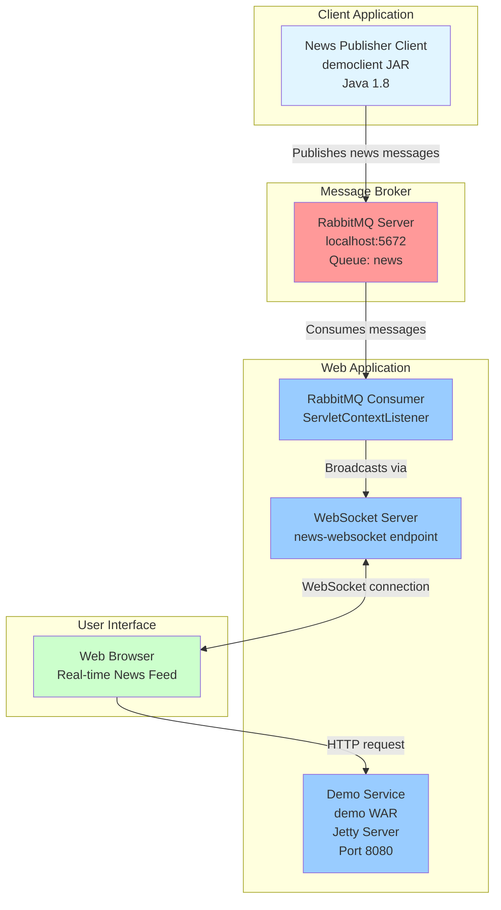
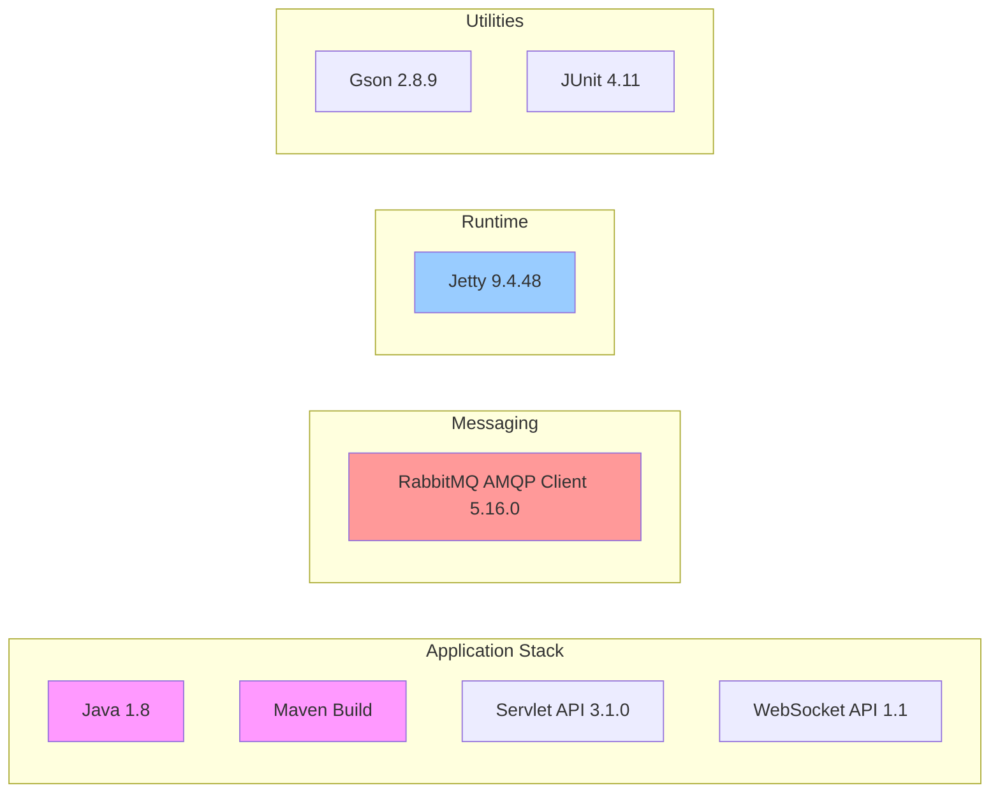
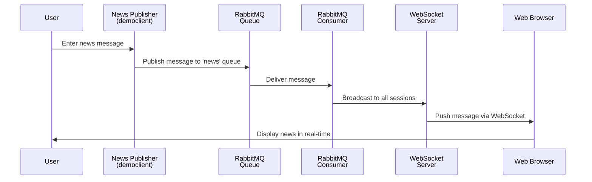
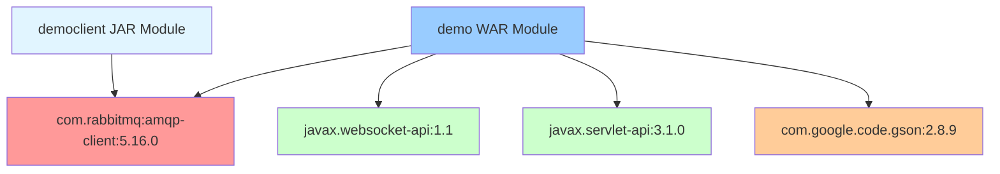
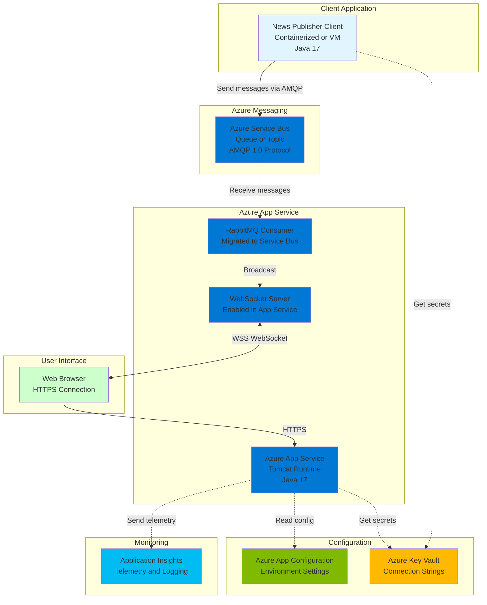
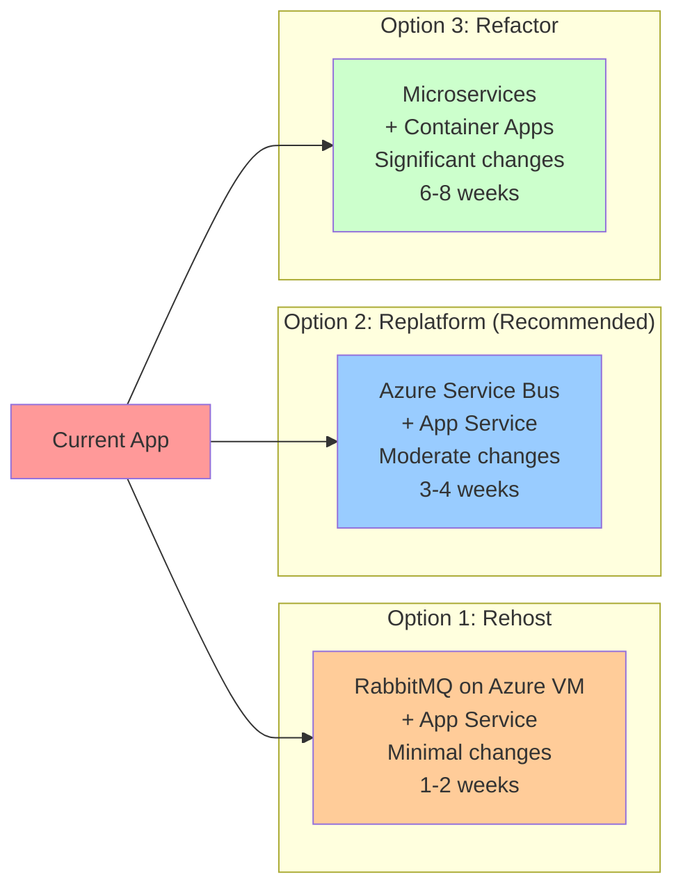
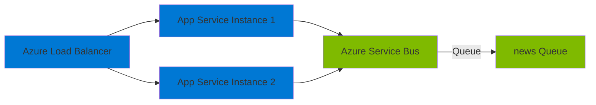
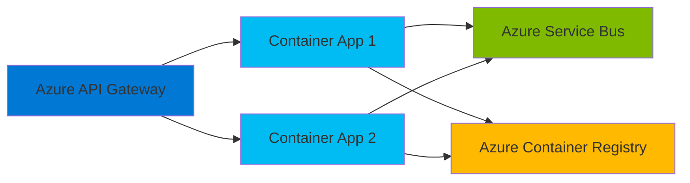

# RabbitMQ News Feed Demo - Architecture Diagram

## Current Architecture

## Technology Stack

## Data Flow Sequence

## Component Dependencies

## Azure Migration Architecture (Recommended)

## Migration Options Comparison

## Key Migration Considerations

### Configuration Changes Required
- **Hardcoded Values**: Externalize RabbitMQ host and queue names
- **Credentials**: Move to Azure Key Vault
- **Environment Settings**: Use Azure App Configuration

### Messaging Migration
- **Current**: RabbitMQ with AMQP client
- **Target**: Azure Service Bus with AMQP 1.0 protocol
- **Changes**: Connection string format, authentication model
- **Benefit**: Minimal code changes, managed service

### Runtime Migration
- **Current**: Embedded Jetty server
- **Target**: Azure App Service with Tomcat
- **Changes**: Deploy as WAR, configure App Service
- **Benefit**: Managed platform, auto-scaling, WebSocket support

### WebSocket Support
- **Current**: javax.websocket-api
- **Target**: Same API on Azure App Service
- **Changes**: Enable WebSocket in App Service configuration
- **Benefit**: No code changes required

### Java Version
- **Current**: Java 1.8
- **Recommended**: Java 17 LTS
- **Changes**: Update pom.xml, test compatibility
- **Benefit**: Long-term support, performance improvements

## Architecture Assessment Summary

### ✅ Cloud-Ready Components
- WebSocket implementation (compatible with Azure App Service)
- Servlet-based web application (standard WAR deployment)
- Maven build system (integrates with Azure DevOps/GitHub Actions)
- AMQP messaging protocol (supported by Azure Service Bus)

### ⚠️ Components Requiring Changes
- Hardcoded configuration (host, queue names)
- RabbitMQ-specific connection code
- Missing authentication/authorization
- No structured logging or monitoring
- Embedded Jetty server (needs platform migration)

### 🔧 Recommended Enhancements
- Add Application Insights for monitoring
- Implement Azure Key Vault integration
- Upgrade to Java 17 LTS
- Add CI/CD pipeline configuration
- Create Dockerfile for containerization option
- Implement health check endpoints
- Add structured logging (SLF4J/Logback)

## Deployment Architecture Options

### Option 1: Azure App Service (Recommended for Quick Start)

### Option 2: Azure Container Apps (For Microservices)

## Next Steps

1. **Immediate**: Externalize configuration to environment variables
2. **Short-term**: Set up Azure resources (App Service, Service Bus)
3. **Medium-term**: Migrate messaging to Azure Service Bus
4. **Long-term**: Add monitoring, upgrade Java version, consider containerization

---

*Generated from application assessment on 2026-02-11*
