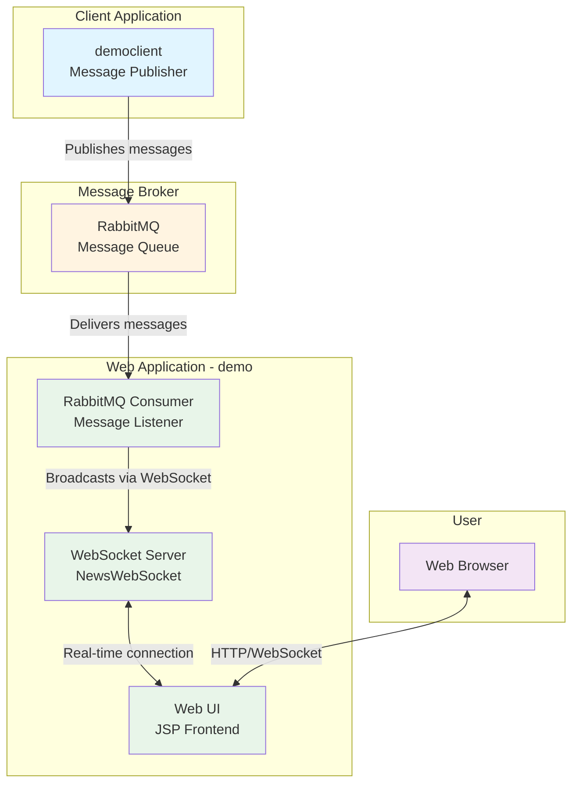

# RabbitMQ News Feed Architecture Diagram

## Application Overview

This is a Java-based news feed application that demonstrates real-time messaging using RabbitMQ message broker and WebSocket communication.

## Architecture Diagram

## Technology Stack

### Demo Web Application (WAR)
- **Framework**: Java Servlet/JSP
- **Web Server**: Eclipse Jetty 9.4.48
- **Java Version**: 1.8
- **Build Tool**: Maven
- **Dependencies**:
  - RabbitMQ AMQP Client 5.16.0
  - WebSocket API 1.1 (javax.websocket)
  - Servlet API 3.1.0 (javax.servlet)
  - Gson 2.8.9 (JSON processing)

### Demo Client Application (JAR)
- **Type**: Command-line application
- **Java Version**: 1.8
- **Build Tool**: Maven
- **Dependencies**:
  - RabbitMQ AMQP Client 5.16.0

## Application Layers

### 1. Presentation Layer
- **Component**: Web UI (index.jsp)
- **Technology**: JSP with embedded JavaScript
- **Function**: 
  - Displays news feed in browser
  - Establishes WebSocket connection
  - Real-time message updates
  - Auto-reconnection logic

### 2. Communication Layer
- **Component**: NewsWebSocket
- **Technology**: Java WebSocket API (javax.websocket)
- **Endpoint**: /news-websocket
- **Function**:
  - Manages WebSocket sessions
  - Broadcasts messages to all connected clients
  - Handles connection lifecycle (open, close, error)

### 3. Integration Layer
- **Component**: RabbitMQConsumer
- **Technology**: RabbitMQ Java Client
- **Function**:
  - Listens to RabbitMQ queue
  - Consumes messages from 'news' queue
  - Forwards messages to WebSocket broadcast
  - Lifecycle managed by ServletContextListener

### 4. Message Producer
- **Component**: democlient App
- **Technology**: RabbitMQ Java Client
- **Function**:
  - Command-line interface for publishing messages
  - Publishes user input to RabbitMQ 'news' queue
  - Interactive message entry

## Data Flow

1. **Message Publishing**:
   - User enters message in democlient CLI
   - democlient publishes message to RabbitMQ 'news' queue

2. **Message Consumption**:
   - RabbitMQConsumer listens to 'news' queue
   - Receives message from RabbitMQ
   - Broadcasts message via NewsWebSocket

3. **Real-time Display**:
   - WebSocket pushes message to all connected browser clients
   - Web UI displays message with timestamp
   - Messages appear in real-time without page refresh

## External Dependencies

### Message Broker
- **Service**: RabbitMQ 3 (with Management Plugin)
- **Connection**: localhost:5672
- **Management UI**: localhost:15672
- **Queue**: news (non-durable, non-exclusive, no auto-delete)

### Runtime Environment
- **Java Runtime**: JRE 8 or higher
- **Web Server**: Jetty (embedded, port 8080)
- **Context Path**: /demo

## Key Architectural Patterns

1. **Message-Driven Architecture**: Uses RabbitMQ for asynchronous message delivery
2. **Publish-Subscribe Pattern**: Multiple clients can receive the same messages via WebSocket broadcast
3. **Real-time Communication**: WebSocket for bi-directional, low-latency communication
4. **Event-Driven**: ServletContextListener initializes RabbitMQ consumer on application startup
5. **Separation of Concerns**: Clear separation between message producer, broker, consumer, and presentation

## Deployment Configuration

- **demo (Web App)**: Runs on Jetty at http://localhost:8080/demo/
- **democlient**: Standalone Java application
- **RabbitMQ**: Docker container (rabbitmq:3-management)
