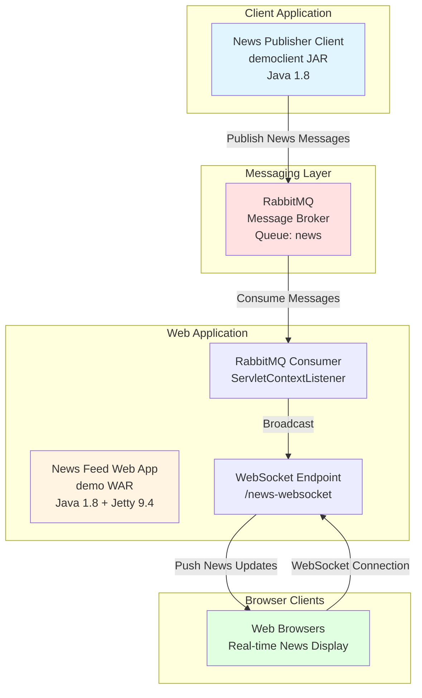

# Architecture Diagram - asbdemo Application

## Current Architecture

## Technology Stack

### Application Components

| Component | Type | Framework | Purpose |
|-----------|------|-----------|---------|
| democlient | JAR | Java SE 1.8 | News publisher client application |
| demo | WAR | Java EE + Jetty 9.4 | Web application with WebSocket support |

### Key Dependencies

| Dependency | Version | Purpose |
|------------|---------|---------|
| RabbitMQ AMQP Client | 5.16.0 | Message broker client |
| WebSocket API | 1.1 | Real-time browser communication |
| Servlet API | 3.1.0 | Web application framework |
| Gson | 2.8.9 | JSON processing |
| Jetty | 9.4.48 | Embedded web server |

### External Services

- **RabbitMQ**: Message broker for asynchronous communication between publisher and consumer
- **WebSocket**: Protocol for bidirectional real-time communication with browsers

## Data Flow

1. **News Publishing**: Client application publishes news messages to RabbitMQ queue
2. **Message Consumption**: Web application consumer listens to RabbitMQ queue
3. **Real-time Broadcasting**: Consumer broadcasts messages to all connected WebSocket clients
4. **Browser Display**: Browsers receive real-time news updates via WebSocket

## Architecture Characteristics

- **Messaging Pattern**: Asynchronous pub/sub using RabbitMQ
- **Real-time Communication**: WebSocket for push notifications to browsers
- **Deployment Model**: 
  - Standalone JAR client application
  - WAR web application deployed on Jetty server
- **Configuration**: Hardcoded (requires externalization for cloud deployment)

## Cloud Migration Considerations

Based on the assessment, this architecture will require the following changes for Azure deployment:

1. **Messaging**: Migrate from RabbitMQ to Azure Service Bus
2. **Configuration**: Externalize to Azure App Configuration or environment variables
3. **WebSocket**: Enable WebSocket support in Azure App Service or use Azure SignalR Service
4. **Deployment**: Containerize or deploy as standard WAR to Azure App Service

---

*Generated from assessment results - 2026-02-11*
