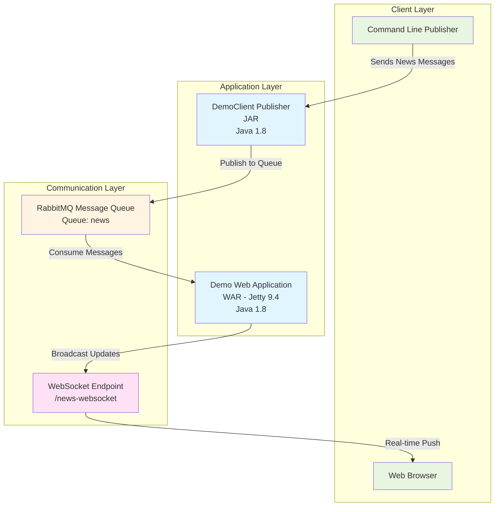
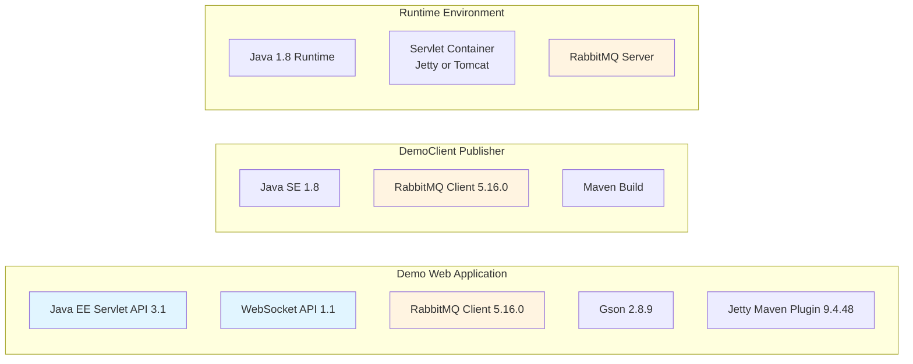
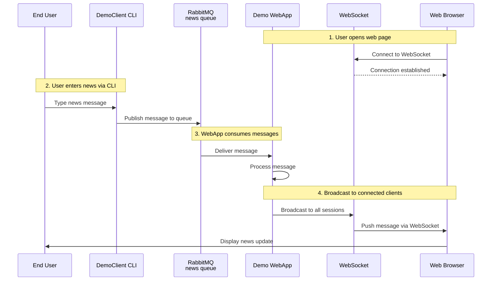
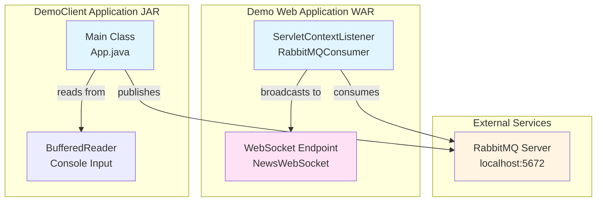
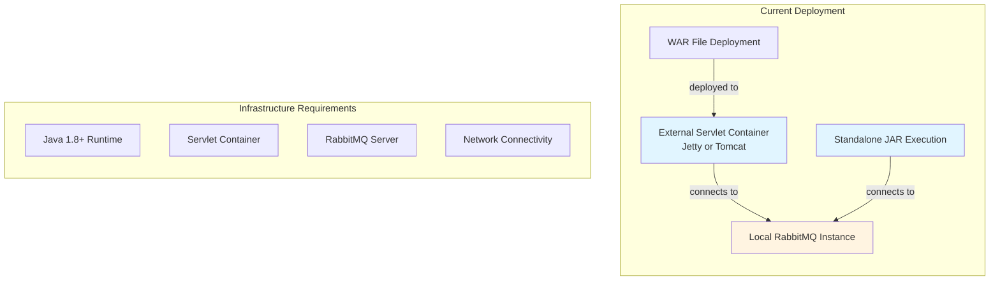
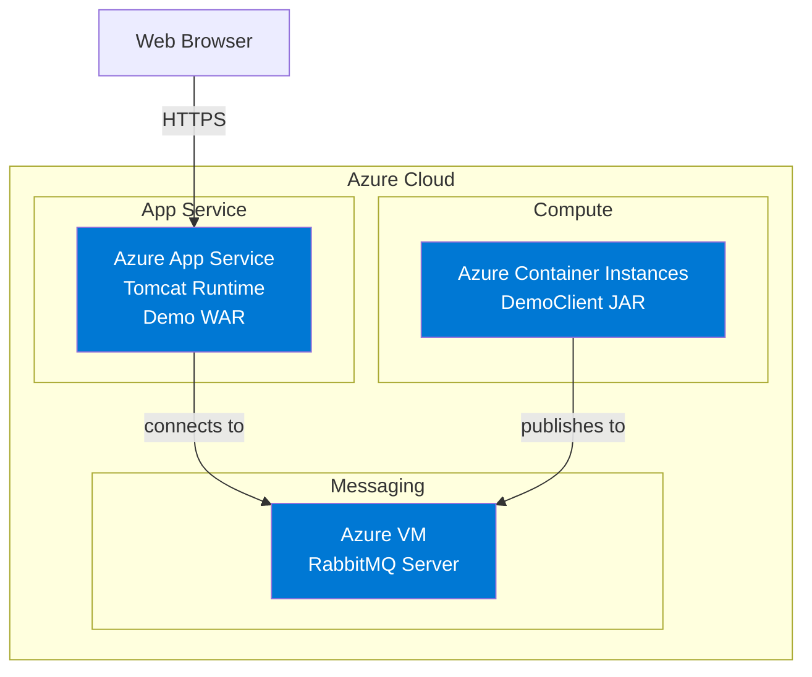
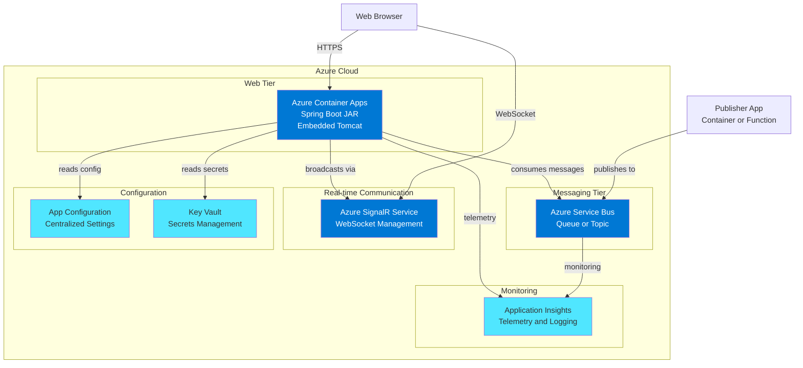
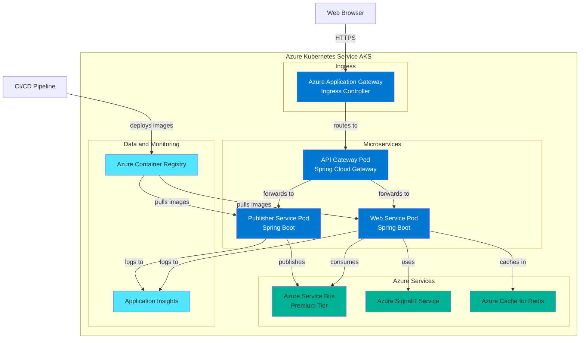
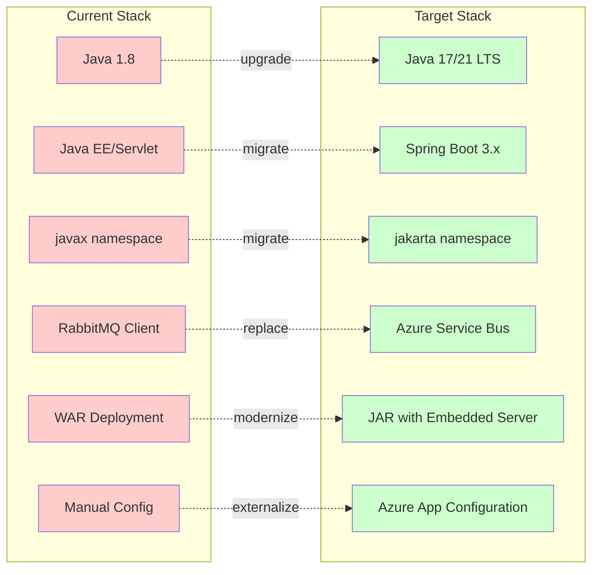

# Application Architecture Diagram

This document contains architecture diagrams generated from the assessment of the RabbitMQ News Feed application.

## Current Application Architecture

### High-Level Architecture

### Technology Stack

### Data Flow

### Component Architecture

### Deployment Model

## Azure Migration Architecture Options

### Option 1: Lift and Shift to Azure

### Option 2: Modernize with Azure Native Services

### Option 3: Cloud-Native Microservices

## Key Architecture Insights

### Current State Assessment

**Strengths:**
- Simple, straightforward architecture
- Clear separation of concerns (publisher vs consumer)
- Real-time communication via WebSocket
- Message queue for decoupling

**Challenges:**
- Legacy Java 1.8 platform
- Hardcoded configuration values
- Traditional WAR deployment model
- Direct RabbitMQ dependency
- Limited cloud-native features
- No authentication or authorization
- Minimal error handling and monitoring

### Migration Recommendations

**Short-term (1-2 weeks):**
1. Upgrade to Java 17 or 21 LTS
2. Externalize configuration to environment variables
3. Update dependencies to latest versions
4. Add basic health check endpoints

**Medium-term (3-4 weeks):**
1. Migrate to Spring Boot framework
2. Replace RabbitMQ with Azure Service Bus
3. Containerize with Docker
4. Deploy to Azure Container Apps or App Service
5. Implement Azure Application Insights
6. Add authentication via Azure AD

**Long-term (6-8 weeks):**
1. Consider microservices architecture if scalability is needed
2. Implement API Gateway pattern
3. Add caching layer (Azure Redis Cache)
4. Implement comprehensive CI/CD pipeline
5. Add blue-green deployment capability

## Technology Migration Path

## Summary

This RabbitMQ News Feed application demonstrates a classic message-driven architecture with real-time WebSocket communication. While the current implementation is functional, migrating to Azure with modern frameworks like Spring Boot and Azure-native services (Service Bus, SignalR) will provide:

- **Better Scalability:** Auto-scaling, load balancing, and managed services
- **Enhanced Security:** Azure AD integration, managed identities, Key Vault
- **Improved Reliability:** Built-in high availability, disaster recovery
- **Easier Operations:** Centralized monitoring, configuration, and deployment
- **Cost Efficiency:** Pay-as-you-go pricing, serverless options, resource optimization

The recommended approach is **Option 2: Modernize with Azure Native Services** as it provides the best balance of effort, risk, and cloud benefits for this application's size and complexity.
