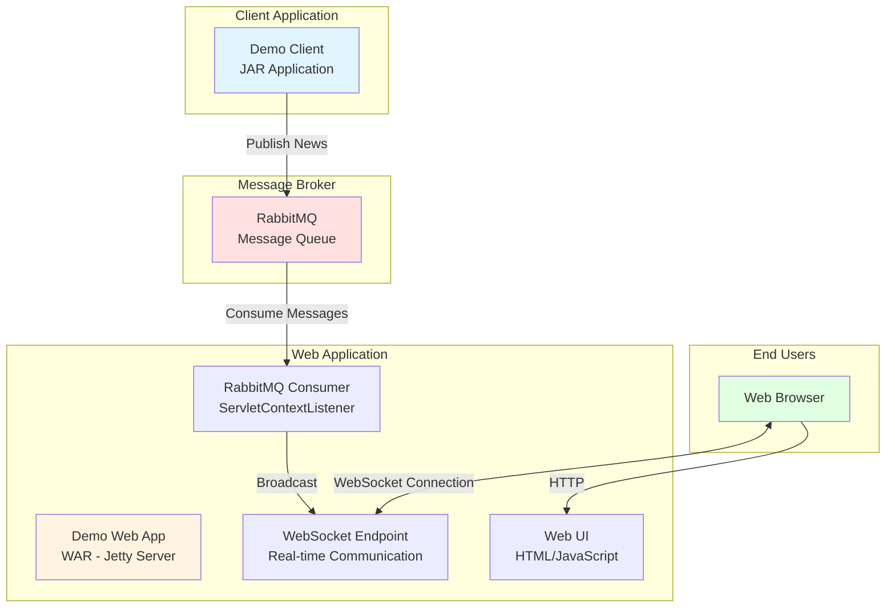
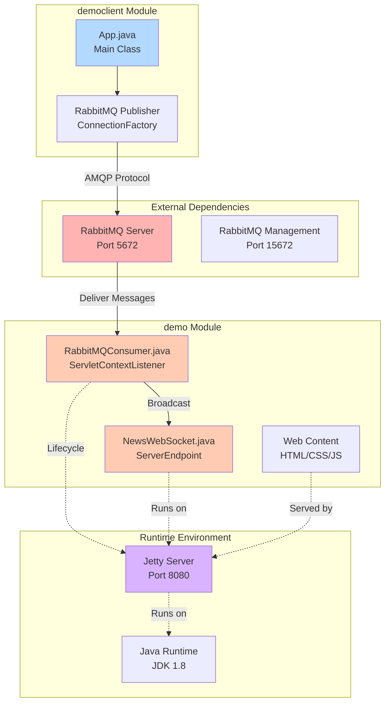
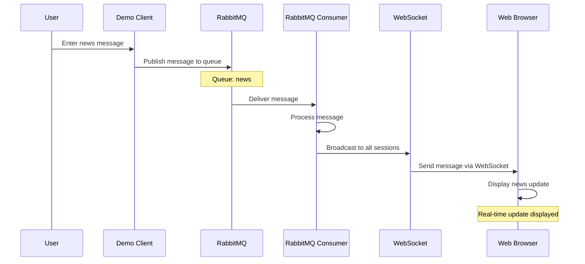
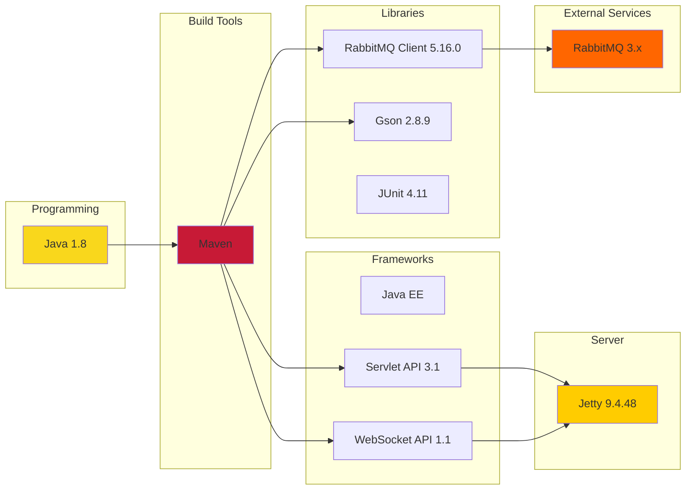
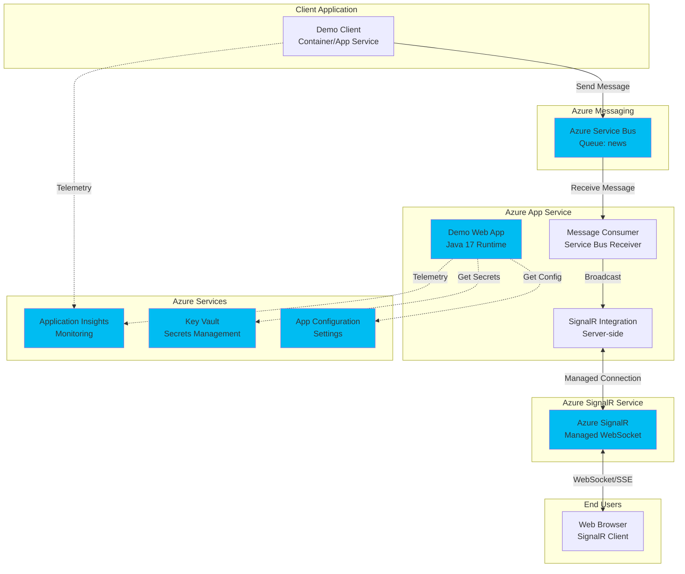
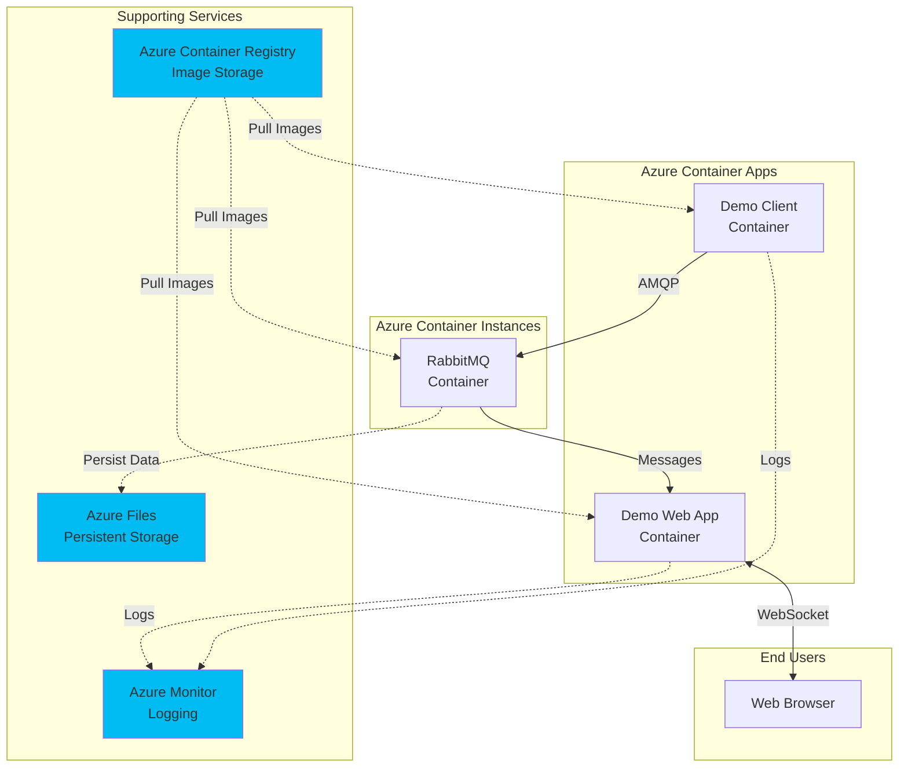

# Architecture Diagram - RabbitMQ News Feed Demo

This document contains architecture diagrams for the RabbitMQ News Feed Demo application, generated from the assessment results.

## Table of Contents
- [Current Architecture](#current-architecture)
- [Component Diagram](#component-diagram)
- [Sequence Diagram](#sequence-diagram)
- [Technology Stack](#technology-stack)
- [Azure Migration Architecture](#azure-migration-architecture)

---

## Current Architecture

This diagram shows the high-level architecture of the current application.

### Architecture Description

**Components:**
1. **Demo Client (democlient)**: Standalone Java application that publishes news messages to RabbitMQ
2. **RabbitMQ**: Message broker that handles asynchronous message delivery
3. **Demo Web App (demo)**: Java EE web application that consumes messages and broadcasts to browsers
4. **Web Browser**: End-user interface that receives real-time updates via WebSocket

**Flow:**
1. User enters news message in Demo Client CLI
2. Client publishes message to RabbitMQ queue named "news"
3. Web App's RabbitMQ Consumer receives message
4. Consumer broadcasts message to all connected WebSocket clients
5. Web browsers display the news in real-time

---

## Component Diagram

Detailed view of application components and their relationships.

---

## Sequence Diagram

Message flow through the system.

---

## Technology Stack

Key technologies used in the application.

---

## Azure Migration Architecture

Recommended Azure architecture after migration.

### Option 1: Refactor with Azure Native Services (Recommended)

### Option 2: Lift and Shift with Containers

---

## Migration Comparison

| Aspect | Current | Azure Native (Option 1) | Containerized (Option 2) |
|--------|---------|------------------------|-------------------------|
| **Messaging** | RabbitMQ (self-hosted) | Azure Service Bus | RabbitMQ (container) |
| **WebSocket** | Custom implementation | Azure SignalR Service | Custom implementation |
| **Hosting** | Jetty (on-premise) | Azure App Service | Azure Container Apps |
| **Configuration** | Hardcoded | Azure App Configuration + Key Vault | Environment variables |
| **Monitoring** | Manual/Custom | Application Insights | Azure Monitor |
| **Scalability** | Manual | Auto-scale | Manual/Auto-scale |
| **Maintenance** | High | Low | Medium |
| **Azure Integration** | None | Native | Moderate |
| **Migration Effort** | N/A | Medium | Low-Medium |
| **Recommended For** | Current state | Production, Long-term | Quick migration, Testing |

---

## Key Findings

### Current Architecture Strengths
- ✅ Simple, easy to understand architecture
- ✅ Asynchronous messaging pattern
- ✅ Real-time updates via WebSocket
- ✅ Separation between publisher and consumer

### Current Architecture Challenges
- ⚠️ Hardcoded configuration (localhost, queue names)
- ⚠️ Outdated Java version (1.8)
- ⚠️ Self-managed RabbitMQ infrastructure
- ⚠️ No cloud-native features
- ⚠️ Limited scalability options
- ⚠️ Manual monitoring and operations

### Azure Migration Benefits
- ✅ Fully managed messaging with Azure Service Bus
- ✅ Scalable WebSocket with Azure SignalR
- ✅ Automated monitoring with Application Insights
- ✅ Secure configuration with Key Vault
- ✅ Auto-scaling capabilities
- ✅ Built-in high availability
- ✅ Reduced operational overhead

---

## Next Steps

1. **Review Assessment Report**: See `.github/modernize/report.json` for detailed findings
2. **Choose Migration Strategy**: Select between refactor (recommended) or lift-and-shift
3. **Plan Migration**: Create detailed migration plan based on chosen strategy
4. **Implement Changes**: Follow recommendations in assessment report
5. **Test Thoroughly**: Validate all functionality in Azure environment
6. **Deploy**: Use CI/CD pipeline for automated deployment

---

**Generated:** 2026-02-11T06:59:46.514Z  
**Tool:** Assessment Diagram Skill  
**Repository:** showpune/asbdemo
