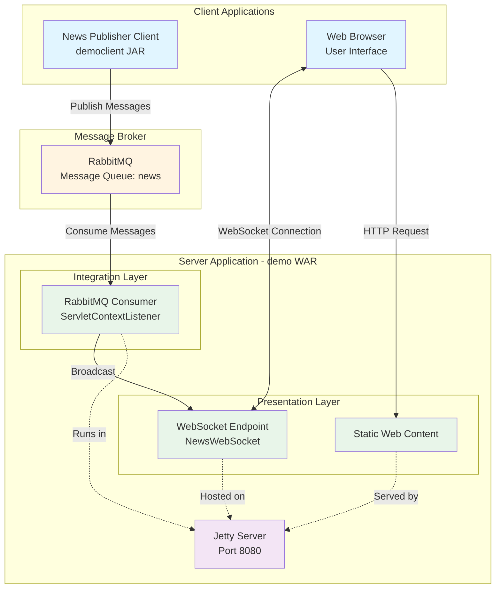
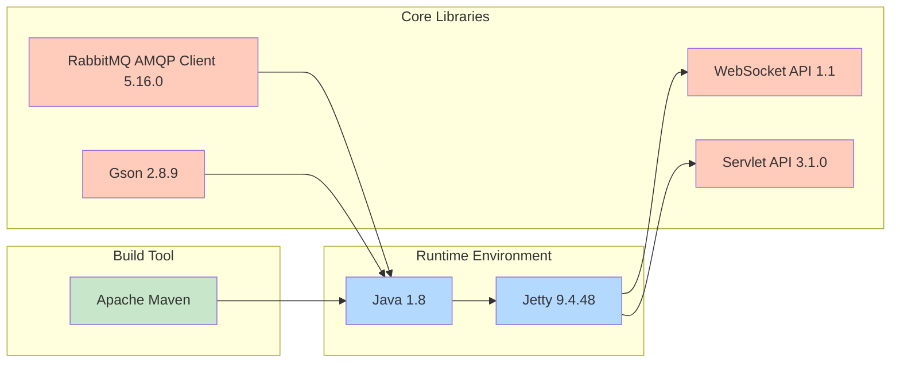
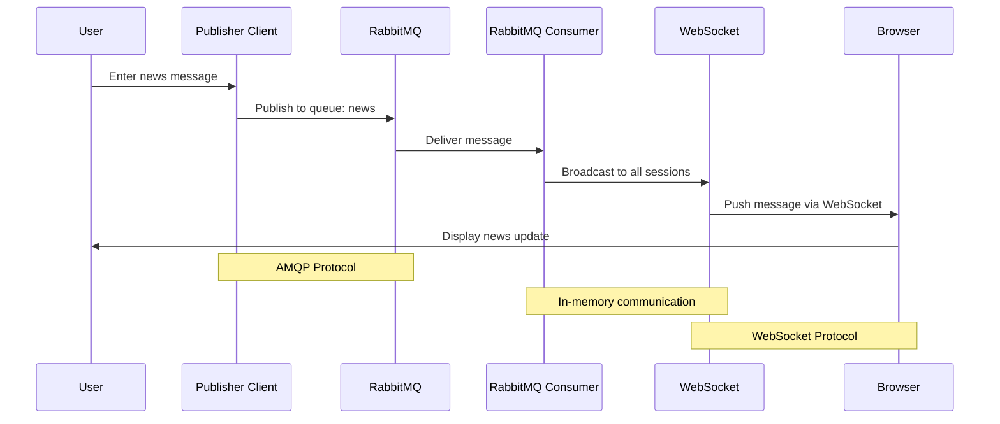
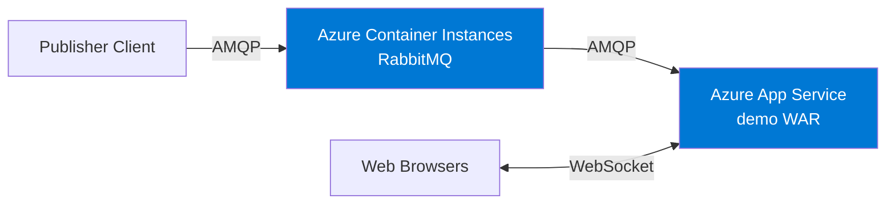
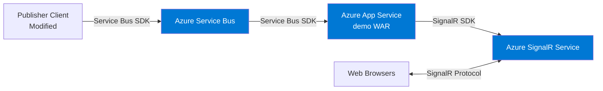
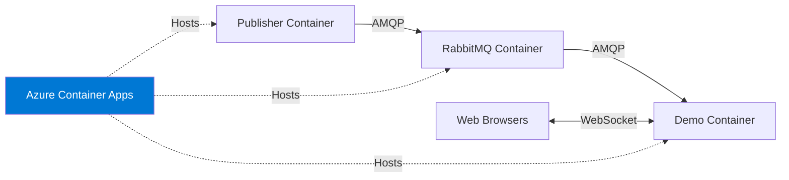

# Architecture Diagram - RabbitMQ News Feed Demo

## Application Overview

This is a real-time news feed application that demonstrates message-driven architecture using RabbitMQ for messaging and WebSocket for browser updates.

## High-Level Architecture

## Technology Stack

## Data Flow

## Component Details

### Publisher Client (democlient)
- **Type**: Standalone Java application (JAR)
- **Purpose**: Publishes news messages to RabbitMQ queue
- **Technology**: Java 1.8, RabbitMQ AMQP Client
- **Execution**: Command-line interface with user input

### Server Application (demo)
- **Type**: Web application (WAR)
- **Purpose**: Consumes messages from RabbitMQ and broadcasts to browsers
- **Technology**: Java 1.8, Jetty, WebSocket, Servlet API
- **Components**:
  - **RabbitMQConsumer**: ServletContextListener that connects to RabbitMQ on startup and consumes messages
  - **NewsWebSocket**: WebSocket endpoint that manages browser connections and broadcasts messages
  - **Static Content**: HTML/JS for browser interface

### Message Broker (RabbitMQ)
- **Type**: External message broker
- **Purpose**: Decouples message publishing from consumption
- **Queue**: "news" queue for message storage
- **Deployment**: Docker container (for development)

## Architecture Characteristics

### Strengths
- ✅ **Loose Coupling**: Publisher and consumer are decoupled through RabbitMQ
- ✅ **Real-time Updates**: WebSocket provides instant message delivery to browsers
- ✅ **Scalability**: Message queue can handle high message throughput
- ✅ **Simplicity**: Clean separation of concerns with clear component boundaries

### Considerations for Azure Migration
- ⚠️ **Configuration Management**: RabbitMQ host and queue names are hardcoded
- ⚠️ **State Management**: WebSocket sessions stored in-memory (limits horizontal scaling)
- ⚠️ **Infrastructure Dependencies**: Requires RabbitMQ infrastructure
- ⚠️ **Java Version**: Java 1.8 is outdated (recommend Java 11+ for Azure)

## Azure Migration Options

### Option 1: Lift and Shift

### Option 2: Azure Native Services

### Option 3: Container-Based

## Deployment Architecture

### Current Development Setup
- **Publisher**: Run via Maven exec plugin
- **Server**: Jetty embedded server (Maven plugin)
- **RabbitMQ**: Docker container on localhost
- **Browser**: Connect to http://localhost:8080/demo/

### Recommended Azure Production Setup
- **Publisher**: Azure Container Apps or scheduled Azure Functions
- **Server**: Azure App Service (Java 11+) or Azure Container Apps
- **Messaging**: Azure Service Bus (recommended) or RabbitMQ in containers
- **Real-time**: Azure SignalR Service (for multi-instance scaling)
- **Monitoring**: Azure Application Insights
- **Secrets**: Azure Key Vault

---

*Generated from assessment results on 2026-02-11*
